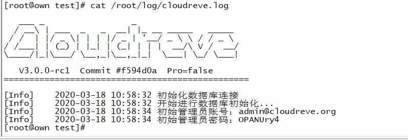
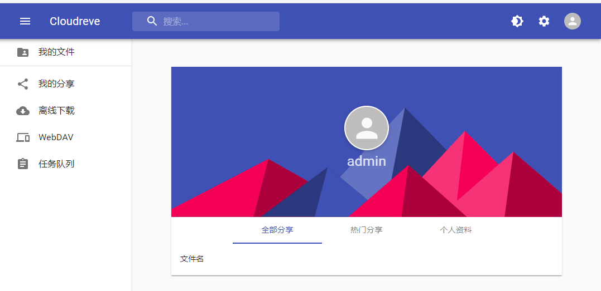
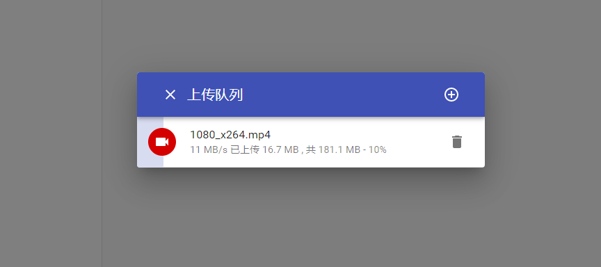
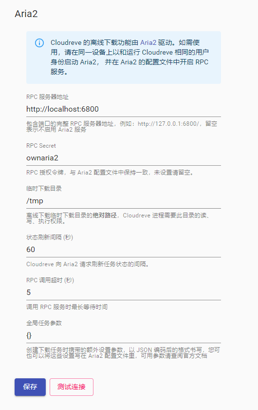
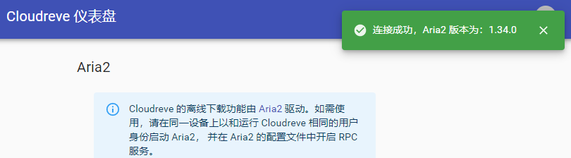
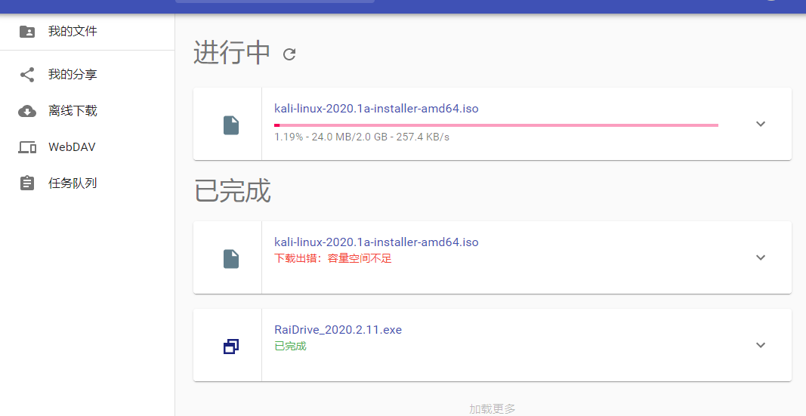
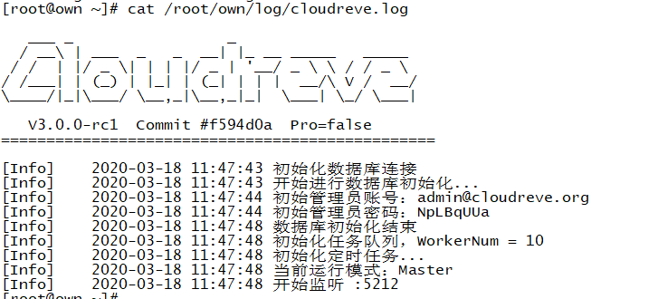

# cloudreve docker


[Cloudreve ](https://github.com/cloudreve/cloudreve)

[GitHub](https://github.com/WumaCoder/cloudreve-docker)

[Gitee](https://gitee.com/WumaCoder/cloudreve-docker)

[Docker 手册内置安装教程](https://www.jianshu.com/p/6d44b7d1a267)

> cloureve-docker 是对 cloudreve 的 docker 封装，这里我们致敬 cloudreve 的开发者，我试过很多的云盘 cloudreve 是最舒服的，而且开发者没有因为割韭菜而阉割免费版，非常感谢。
>
> 用户通过 cloudreve-docker 安装 cloudreve 可以快速的体验私人云盘的快感（去 tm 的百度云），并且 cloudreve-docker 提供了 aria2 的离线下载功能，通过简单的配置就可以使用离线下载，并且通过 docker 的数据卷可以非常灵活的对 cloudreve 进行备份、无缝升级、配置以及日志的记录。
> 通过使用 Docker 和 shell 的方式快速的搭建 cloureve 的云盘。

## 准备

- Docker19+
- git

## 快速体验

```bash
git clone https://gitee.com/WumaCoder/cloudreve-docker.git
chmod 775 ./cloudreve-docker/install-shell.sh

# 安装shell命令
./cloudreve-docker/install-shell.sh
# 创建启动镜像，cloudreve-update也可以实现更新cloudreve内核的功能
cloudreve-update
# 查看密码日志
cat /root/own/log/cloudreve.log
```

> 提示：快速体验无缝升级、备份、配置的功能，更多内容请查看下面的可操作数据卷

### 执行上面的代码后可以得到账号和密码



### 在浏览器输入`http://ip:83`，登录后我们就可以看到登录成功



### 接下来就可以体验私人云盘的快感



### 如何使用离线下载呢

默认离线下载是开启的但是需要一些网页上的简单配置，记住下面这些信息。

- RPC 服务器地址：http://localhost:6800
- RPC Secret：ownaria2
- 临时下载目录：/tmp

然后我们跳转到后台管理的离线下载配置页面，输入网站`http://你的ip:83/#/admin/aria2`，在第一次进入后台的时候会弹出一个设置，这个设置是要你设置以后通过什么地址来访问你的私有云盘。如果你不是用 localhost:83 上来的你只需要点确认即可。



我们将刚刚记得的配置信息填入，其他保持默认即可，点击测试连接，会出现连接成功就 okl。



测试一下离线下载。



测试完成可以下载，这个速度是和你的资源有关系。

## 可操作数据卷

前面提到 cloudreve-docker 是一个灵活的 Docker 封装，我们可以通过数据卷的方式可以将数据库、日志、配置信息进行物理空间的映射，映射到宿主机的某个位置后可以方便的进行修改与备份。

| 容器内的数据卷   | 说明                                                               |
| ---------------- | ------------------------------------------------------------------ |
| /core/uploads    | 存储用户上传的文件                                                 |
| /core/log        | 存储 aria2 和 cloudreve 的日志                                     |
| /core/etc        | 存储 cloudreve 的配置                                              |
| /core/db         | 存储数据库文件，这个项依赖于配置文件`conf.ini`里[Database]->DBFile |
| /core/aria2/conf | aria2 的配置文件，不建议修改（除非你会）                           |

### 使用方法

我们直接如上所示，我们在创建并启动容器的时候 docker run 使用 -v 参数来指定，下面是个完整的配置。

> 不过我们更推荐你使用 shell 的方式，来启动和创建

```bash
docker run -d \
	--name own \
	-p 83:83 \
	-v /root/own/log:/core/log \
	-v /root/own/uploads:/core/uploads \
	-v /root/own/db:/core/db \
	-v /root/own/etc:/core/etc \
    cloudreve

# 在安装了shell命令后，这条命令和上面的这条命令功能一样
cloudreve-update own /root 83
# 或者可以更简单
cloudreve-update
# 因为 后面的三个参数默认就是own /root 83
```

我们通过查看/root/own/log/cloudreve.log 文件来获取账号和密码



我们建议端口映射和 cloudreve 的端口设置为一样，以防止出现意外。

### 查看日志

```bash
cat /root/own/log/cloudreve.log
# 查看cloudreve的日志，这里存储着网页登录的初始密码
cat /root/own/log/aria2.log
# 这里存储着离线下载的日志
```

### 备份数据库与文件

```bash
mkdir /root/backup
cp /root/own/db /root/backup
cp /root/own/uploads /root/backup
```

### 修改配置文件

```bash
vi /root/own/etc/conf.ini
```

详细的配置文件如下

```php
[System]
; 运行模式
Mode = master
; 监听端口
Listen = :83
; 是否开启 Debug
Debug = false
; Session 密钥, 一般在首次启动时自动生成
SessionSecret = 23333
; Hash 加盐, 一般在首次启动时自动生成
HashIDSalt = something really hard to guss

; 数据库相关，如果你只想使用内置的 SQLite数据库，这一部分直接删去即可
[Database]
; sqlite数据库位置
DBFile= /core/db/cloudreve.db
; 数据库类型，目前支持 sqlite | mysql
;Type = mysql
; 用户名
;User = owncloud
; 密码
;Password =
; 数据库地址
;Host = mysql
; 数据库名称
;Name = owncloud
; 数据表前缀
;TablePrefix = own

; 从机模式下的配置
[Slave]
; 通信密钥
Secret = 1234567891234567123456789123456712345678912345671234567891234567
; 回调请求超时时间 (s)
CallbackTimeout = 20
; 签名有效期
SignatureTTL = 60

; 跨域配置
[CORS]
AllowOrigins = *
AllowMethods = OPTIONS,GET,POST
AllowHeaders = *
AllowCredentials = false

; Redis 相关
;[Redis]
;Server = 127.0.0.1:6379
;Password =
;DB = 0

; 从机模式缩略图
[Thumbnail]
MaxWidth = 400
MaxHeight = 300
FileSuffix = ._thumb

```

## 操作 cloudreve

#### 创建并运行（第一次使用）

> 推荐使用 shell 方式

```bash
docker run -d \
	--name own \
	-p 83:83 \
	-v /root/own/log:/core/log \
	-v /root/own/uploads:/core/uploads \
	-v /root/own/db:/core/db \
	-v /root/own/etc:/core/etc \
    cloudreve
# -p 端口的映射外部83，内部83
# -v 端口映射
# -d 后台运行
# --name own 这个我给这个容器起的是own这个名字,这个名字很重要,下面的操作已经使用
# --link <ip|域名|其他容器名>:<容器内host>
# eg:
# 	--link localhost:roothost 这里将127.0.0.1映射到容器内roothost这个名字，我们可以ping roothost来测试
```

### 启动

> 推荐使用 shell 方式

```bash
docker start own
```

### 重启

> 推荐使用 shell 方式

```bash
docker restart own
```

### 关闭

> 推荐使用 shell 方式

```bash
docker stop own
```

### 开机自启动

> 这个功能，shell 暂时不支持

```bash
systemctl enable docker
docker update --restart=always own
```

### 升级 cloudreve

> 推荐使用 shell 方式

```bash
git clone https://gitee.com/WumaCoder/cloudreve-docker.git
docker build -t cloudreve ./cloudreve-docker
docker stop own
docker rm own
docker run -d \
	--name own \
	-p 83:83 \
	-v /root/own/log:/core/log \
	-v /root/own/uploads:/core/uploads \
	-v /root/own/db:/core/db \
	-v /root/own/etc:/core/etc \
    cloudreve
```

> 因为我会关注着 cloudreve 最新版，并且会在发布的第一时间进行测试，测试完成后我会放到 cloudreve-docker 的仓库中，所以大家使用这两句代码就可以快速的升级，并且不会丢失文件和数据。

## 安装使用 shell 命令

> 安装 shell 命令后可以快速的实现启动、停止、重启、升级、创建并启动的功能。

### 安装 shell

```bash
git clone https://gitee.com/WumaCoder/cloudreve-docker.git
chmod 775 ./cloudreve-docker/install-shell.sh
./cloudreve-docker/install-shell.sh
```

### 使用 Shell 命令

> 如果你想要和我的配置一样，下面的所又命令都不需要加参数
> 他会在以 own 的名字创建云盘的镜像名称，并且将数据保存在/root/own 下
> 推荐使用 shell 的方式来安装

#### 通过 shell 安装 cloudreve-docker

```bash
./cloudreve-update [云盘容器名] [映射的路径] [外部映射端口]
# 云盘容器名默认为 own
# 映射的路径 是可操作数据卷在物理机上的位置 默认为 /root
# 	cloudreve-update会在/root/own下进行数据卷的映射
# 外部映射端口 默认 83
# 您可能会注意到安装和更新的脚本一样都得cloudreve-update，这不是失误
# 	因为cloudreve-update也可以实现首次安装的功能
```

#### 启动

```bash
cloudreve-start [云盘容器名]
# 云盘容器名默认为 own
```

#### 重启

```bash
cloudreve-restart [云盘容器名]
# 云盘容器名默认为 own
```

#### 状态

```bash
cloudreve-status [云盘容器名]
# 云盘容器名默认为 own
```

#### 停止

```bash
cloudreve-stop [云盘容器名]
# 云盘容器名默认为 own
```

#### 更新

```bash
cloudreve-update [云盘容器名] [映射的路径] [外部映射端口]
# 云盘容器名默认为 own
# 映射的路径 是可操作数据卷在物理机上的位置 默认为 /root
# 	cloudreve-update会在/root/own下进行数据卷的映射
# 外部映射端口 默认 83
```

## 最后

首先非常感谢 cloudreve 团队做出来的这个云盘，正因为他们的东西，我才可以去搞 cloudreve-docker 版。

对于 cloudreve 后期有时间我会做一些实用的辅助，大家可以关注我，来获取动态。

最后如果可以，请帮忙点个 start 让更多的人看见，谢谢。

致敬 cloudreve 团队
